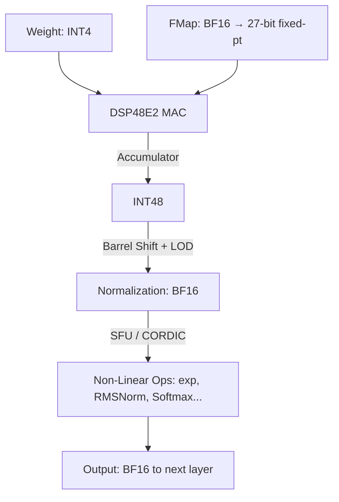

# Archive: v001 Experimental Architecture

> [!WARNING]
> 이 아키텍처는 초기(v001) 실험적 디자인입니다. 구조적으로는 우수하나 GEMM(Matrix) 계산 위주로 설계되었기 때문에, GEMV(Vector) 연산이 주를 이루는 로컬 LLM 환경에 최적화하기 위해 현재는 아카이브(Archive) 보관 중입니다. 

---

## Project Overview

**uXC**는 Xilinx Kria KV260 FPGA(400 MHz, 베어메탈) 위에서 양자화된 **Gemma 3N E4B** 대규모 언어 모델을 가속하기 위해 바닥부터 설계된 커스텀 SystemVerilog 기반 NPU(Neural Processing Unit)입니다. KV260의 1,248 DSP48E2 슬라이스와 144개의 BRAM을 극한으로 활용하도록 설계되었습니다.

- **소프트웨어 베이스라인**: [llm-lite](https://github.com/hwkim-dev/llm-lite) (x64 CPU 분기 구현)
- **풀스택 코디자인**: 하드웨어 가속기(SystemVerilog), Trace-Driven 검증모델(Python), AXI DMA 메모리 파이프라인.

---

## 퀵 메뉴

-   **[Architecture Overview](Architecture/v001_architecture.md)**
    
    ---
    NPU 내부 아키텍처, 3계층 코어 시스템 및 디커플링 모델, 그리고 메모리 전이 레이아웃에 관해 설명합니다.

-   **[ISA Specification](Drivers/ISA.md)**
    
    ---
    64-bit VLIW 코어, Opcode 설계, 레지스터 할당 방법 및 파이프라인 스케줄링.
    
-   **[ISA Spreadsheet](Drivers/ISA_Spreadsheet.md)**

    ---
    전체 ISA 명령집합 구조의 시트 뷰 요약본을 제공합니다.

-   **[C API Detail](Drivers/v001_API.md)**
    
    ---
    NPU 호스트 제어를 담당하는 `uCA_v1_api.c` 및 `uCA_v1_api.h` 헤더의 주된 인터페이스.

-   **[Agents Architecture](agents.md)**
    
    ---
    디커플링된 데이터플로우 모델 안에서의 에이전트 마이크로 스케줄링 설계에 대한 컨셉트.

---

## Quantization Strategy: W4A16 with BF16 Activations

핵심 계산 경로는 **W4A16** 정밀도(Precision)로 운용됩니다:

| Data | Type | Width | Notes |
|------|------|-------|-------|
| **Weight** | INT4 | 4-bit | HP 포트를 통해 Stream 된 후 INT4 형태 그대로 활용 |
| **Feature Map** | BF16 | 16-bit | MAC 연산을 위해 BF16 $\rightarrow$ 27비트 Fixed-Point로 변환 |
| **Accumulator** | INT48 | 48-bit | DSP48E2의 P-Register를 거쳐 누산됨 |
| **SFU I/O** | BF16 | 16-bit | 정규화 이후 비선형(Non-linear) 연산을 위한 BF16 |

### Precision Promotion Flow

비선형 작업(Complex Vector Operation) 처리 시 파이프라인 상에서 **BF16**으로 정밀도가 향상(Promotion)됩니다.

---

## Compute Engines

| 엔진 (Engine) | 연산 (Operation) | 가중치(Weights) 공급 | 활성 함수 (Activation) | 누산기 (Accumulator) |
| ------------- | ------------------| ---------------- | ---------------- | ------------- |
| **Matrix Core** | GEMM (prefill, projections) | HP0/1 (32 INT4/clk) | BF16 $\rightarrow$ 27-bit fixed-pt | INT48 (DSP48E2) |
| **Vector Core** | GEMV (autoregressive decode) | HP2/3 (32 INT4/clk 각각) | BF16 $\rightarrow$ 27-bit fixed-pt | INT48 (DSP48E2) |
| **CVO Core** | Non-linear ops (Softmax, GELU, RoPE 등) | - | L2 캐시에서 BF16 Stream | BF16 |

> **디커플링 데이터플로우(Decoupled Dataflow)** 디자인을 적용해, 명령 인스트럭션이 Global 파이프라인에서 각 모듈로 분산/비동기 발행되므로 구조적 효율이 극대화되어 있습니다.