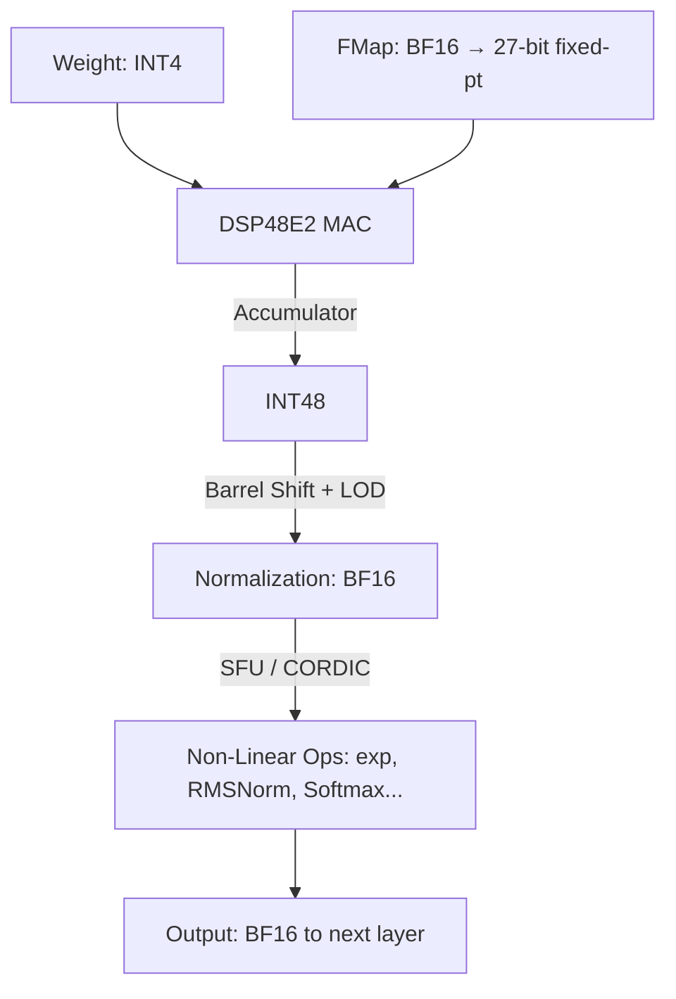

# Archive: v001 Experimental Architecture

> [!WARNING]
> This architecture is a preliminary (v001) experimental design. Although structurally superior, it was engineered with a heavy inclination toward GEMM (Matrix) computations. Because local LLM environments are predominantly bound by GEMV (Vector) operations, this branch has been currently archived in favor of an optimized structure.

---

## Project Overview

**uXC** is a customized SystemVerilog-based Neural Processing Unit (NPU) engineered fundamentally from the ground up to accelerate the quantized **Gemma 3N E4B** Large Language Model on the bare-metal Xilinx Kria KV260 FPGA (400 MHz). The architecture is meticulously designed to push the absolute physical constraints of the KV260 platform, exploiting its 1,248 DSP48E2 slices and 144 BRAMs to their functional ceiling.

- **Software Baseline**: [llm-lite](https://github.com/hwkim-dev/llm-lite) (x64 CPU reference implementation)
- **Full-Stack Co-Design**: Hardware accelerator (SystemVerilog), Trace-Driven validation model (Python), and an AXI DMA memory pipeline.

---

## Quick Menu

-   **[Architecture Overview](Architecture/v001_architecture.md)**
    
    ---
    Illustrates the internal NPU architecture, the 3-tier core system decoupled model, and the memory transition layer layout.

-   **[ISA Specification](Drivers/ISA.md)**
    
    ---
    Explains the 64-bit VLIW core, Opcode routing design, register mappings, and pipeline scheduling methodologies.
    
-   **[ISA Spreadsheet](Drivers/ISA_Spreadsheet.md)**

    ---
    Provides an internal spreadsheet-view breakdown of the overall modular ISA structure.

-   **[C API Detail](Drivers/v001_API.md)**
    
    ---
    Focuses on the primary wrapping interfaces of `uCA_v1_api.c` and `uCA_v1_api.h` targeting the active NPU host controller.

-   **[Agents Architecture](agents.md)**
    
    ---
    Concept logic on the autonomous agent micro-scheduling model operating inside the decoupled dataflow pipeline.

---

## Quantization Strategy: W4A16 with BF16 Activations

The primary core computational path operates strictly at **W4A16 precision**:

| Data | Type | Width | Notes |
|------|------|-------|-------|
| **Weight** | INT4 | 4-bit | Streamed through HP Ports and consumed purely as an INT4 layer |
| **Feature Map** | BF16 | 16-bit | Undergoes conversion from BF16 $\rightarrow$ 27-bit Fixed-Point for native MAC arithmetic |
| **Accumulator** | INT48 | 48-bit | Accumulated recursively through the P-Register of the DSP48E2 blocks |
| **SFU I/O** | BF16 | 16-bit | Reconstructed as BF16 Post-Normalization heading for Non-Linear operations |

### Precision Promotion Flow

At the transition segment toward the Non-Linear operations loop (Complex Vector Operation), the computation elevates precisely into **BF16**.

---

## Compute Engines

| Engine | Operation | Weights Input | Activation Fetch | Accumulator Unit |
| ------------- | ------------------| ---------------- | ---------------- | ------------- |
| **Matrix Core** | GEMM (prefill, projections) | HP0/1 (32 INT4/clk) | BF16 $\rightarrow$ 27-bit fixed-pt | INT48 (DSP48E2) |
| **Vector Core** | GEMV (autoregressive decode) | HP2/3 (32 INT4/clk each) | BF16 $\rightarrow$ 27-bit fixed-pt | INT48 (DSP48E2) |
| **CVO Core** | Non-linear ops (Softmax, GELU, RoPE) | N/A | BF16 Stream via L2 | BF16 |

> Applying a structural **Decoupled Dataflow** design principle ensures operation instructions execute asynchronously. Distributed from the Global Pipeline across distinct modules, it completely prevents architectural stalling and pushes mathematical hardware throughput to its peak.