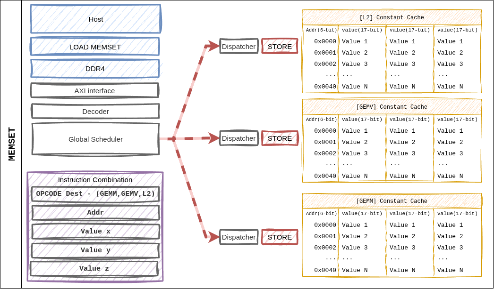

========================
Per-Instruction Dataflow
========================

This page shows how data actually moves through the hardware once an
instruction is dispatched. The figures below recast the block diagram
from :doc:`../Architecture/top_level` through an instruction's lens.

1. GEMM
========

.. figure:: ../../../assets/images/Architecture/v002/DataFlow_GEMM_v002.png
   :align: center
   :width: 85%
   :alt: GEMM instruction dataflow

   **Figure 5.** Dataflow when a GEMM instruction dispatches.
   ``dest_addr`` and ``src_addr`` live in the L2 cache address space;
   shape / size pointers index the Constant Cache.

Path Summary
------------

1. Dispatcher reads ``shape_ptr_addr`` / ``size_ptr_addr`` from the
   Constant Cache to obtain the tile parameters.
2. Weight Buffer prefetches a tile's worth of **weights** from the HP
   ports.
3. L2 cache ``src_addr`` streams **activations** into the systolic array.
4. The array accumulates Weight Stationary → Accumulator → Post-Process.
5. The result is written back to L2 cache at ``dest_reg``.

2. GEMV
=======

.. figure:: ../../../assets/images/Architecture/v002/DataFlow_GEMV_v002.png
   :align: center
   :width: 85%
   :alt: GEMV instruction dataflow

   **Figure 6.** Dataflow for a GEMV instruction. Same ISA layout as
   GEMM, but weights are consumed in a **Weight Streaming** pattern,
   fanning out across 4 GEMV cores in parallel.

Path Summary
------------

1. Dispatcher resolves pointers → per-core shape distribution.
2. Weight Buffer → 4 GEMV cores, streaming **by row partition**.
3. L2 cache → per-core L1 cache for activation preload.
4. 32-lane LUT-based MAC inside each core + 5-stage reduction tree → scalar result.
5. Post-Process (scale, bias) → L2 cache or direct SFU FIFO.

3. MEMCPY
=========

.. figure:: ../../../assets/images/Architecture/v002/DataFlow_MEMCPY_v002.png.png
   :align: center
   :width: 70%
   :alt: MEMCPY instruction dataflow

   **Figure 7.** MEMCPY instruction. The ``from_device`` / ``to_device``
   combination supports host ↔ NPU and NPU ↔ NPU transfers.

Supported Combinations
----------------------

.. list-table::
   :header-rows: 1
   :widths: 20 20 60

   * - from_device
     - to_device
     - Path
   * - 1 (Host)
     - 0 (NPU)
     - ACP → L2 cache write. Used for weight / input loads.
   * - 0 (NPU)
     - 1 (Host)
     - L2 cache → ACP. Returns output tokens / KV entries.
   * - 0 (NPU)
     - 0 (NPU)
     - Intra-L2 block move (on-device rearrangement).

When ``async = 1``, execution continues to the next instruction
immediately. The Global Scheduler tracks the completion fence.

4. MEMSET
=========

   **Figure 8.** MEMSET writes directly from the Dispatcher into the
   Constant Cache — the only instruction that bypasses the L2 cache.

Characteristics
---------------

- A single instruction can write up to three 16-bit values (``a``,
  ``b``, ``c``) at once.
- Typical use: initialize the (M, N, K) tuple at the start of a layer,
  or inject weight / activation scale factors.
- ``dest_cache`` selects which cache bank is targeted (fmap_shape vs.
  weight_shape).

5. CVO (SFU)
=============

CVO does not have a dedicated figure, but the path is:

.. code-block:: text

   Dispatcher
       │
       ▼
   cvo_control_uop_t → SFU (single BF16 scalar pipeline)
                          ▲
                          │ L2 cache ``src_addr``  ─── input vector
                          │
                          ▼
                       function pipeline (CORDIC / LUT)
                          │
                          └─► L2 cache ``dst_addr`` / GEMV direct FIFO

**Fast Path**: if the SFU consumes the output of the preceding GEMV
immediately, ``src_addr`` is set to a **special tag** and the L2 round
trip is skipped. The Dispatcher's dependency-tracking logic decides this
automatically.

6. Dependencies and Completion
===============================

Inter-instruction dependencies are resolved in the Global Scheduler via
two checks.

- **Address hazard**: read-after-write on dest / src L2 addresses.
- **Resource hazard**: occupancy of the GEMM / GEMV / SFU resources.

Completion of an asynchronous instruction (``async = 1``) is collected
by the ``fsmout_npu_stat_collector`` block and reported to the host via
the AXI-Lite STAT_OUT register.
