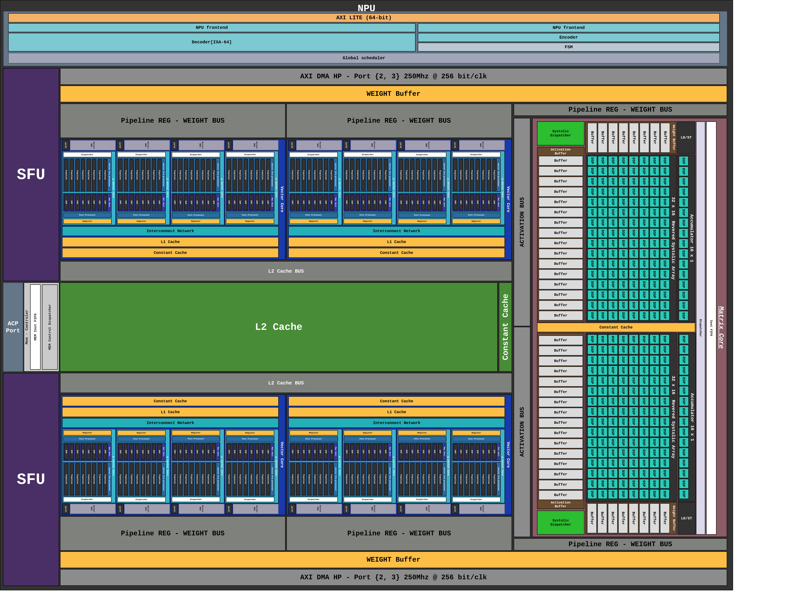

=====================
물리 플로어플랜
=====================

   **Figure 2.** pccx v002 의 물리 플로어플랜.
   L2 Cache 가 중앙에 배치되어 상하 대칭으로 배치된 GEMV·SFU 뱅크와
   양측에 위치한 시스톨릭 어레이에 액티베이션을 공급합니다.

1. 대칭형 배치 전략
===================

pccx v002 의 핵심 물리적 특징은 **중앙 공유 L2 캐시 + 대칭 컴퓨트 슬라이스**
구조입니다.

- **중앙 L2 캐시**: 플로어플랜의 기하학적 중심에 배치되어, 상하 슬라이스가
  동일한 레이턴시로 액티베이션에 접근합니다.
- **상하 대칭 슬라이스**: 각 슬라이스에는 GEMV 32×1 뱅크, SFU 뱅크,
  Constant Cache, L1 Cache 가 포함됩니다. 디코딩 단계에서 두 슬라이스가
  병렬로 서로 다른 배치/헤드 또는 multi-query 를 처리할 수 있습니다.
- **우측 시스톨릭 어레이**: 32×16 시스톨릭 어레이 2 개가 나란히 배치되어
  프리필 단계의 대규모 GEMM 을 담당합니다.

2. 버스 구조
============

.. list-table::
   :header-rows: 1
   :widths: 25 75

   * - 버스
     - 용도
   * - **WEIGHT BUS**
     - Weight Buffer → GEMM/GEMV 코어의 파이프라인 레지스터로 가중치 브로드캐스트.
       파이프라인 레지스터(*Pipeline REG - WEIGHT BUS*) 가 각 뱅크 직전에
       배치되어 타이밍을 완화.
   * - **ACTIVATION BUS**
     - L2 Cache ↔ GEMV / SFU / Systolic Array. 수직 축으로 중앙 L2 에서
       상하로 분배되며, 양방향 기록/판독이 가능.
   * - **AXI DMA HP Port [2, 3]**
     - 상단·하단 슬라이스 각각이 독립적인 HP 포트를 통해 호스트 DDR4 로부터
       가중치를 스트리밍. **256 bit/clk @ 250 MHz** 의 유효 대역폭.

3. 캐시 뱅크 구성
=================

각 슬라이스 내부의 캐시는 **기능별 분할** 됩니다.

.. list-table::
   :header-rows: 1
   :widths: 22 18 60

   * - 캐시
     - 용도
     - 설명
   * - **L1 Cache**
     - 코어 로컬
     - GEMV 연산의 직접 액세스용. 코어당 private.
   * - **Constant Cache**
     - 상수 저장
     - ISA 의 shape/size 포인터, weight scale factor 등 저장. MEMSET 으로
       프리셋.
   * - **L2 Cache**
     - 중앙 공유
     - 액티베이션, KV 캐시, 중간 결과. 양측 슬라이스가 동시 접근.
   * - **Weight Buffer**
     - 가중치 스트림
     - 순환 큐 형태로 HP 포트에서 스트리밍된 INT4 가중치 일시 저장.

4. 물리 설계상의 고려사항
=========================

4.1 라우팅 대칭성
-----------------

L2 Cache 와 상·하 슬라이스 간 배선 길이를 대칭화하여, 두 슬라이스의
액티베이션 접근 레이턴시를 동일하게 유지합니다. 이는 소프트웨어 측에서
양 슬라이스를 **대칭적 작업 분할(symmetric work partitioning)** 에
매핑하기 위한 전제입니다.

4.2 DSP 슬라이스 집중 배치
--------------------------

KV260 의 1,248 개 DSP48E2 중 대부분이 우측 시스톨릭 어레이 영역에 배치되며,
GEMV 및 SFU 뱅크는 LUT/BRAM 기반 연산으로 DSP 사용을 최소화합니다.
자세한 배치는 리소스 활용 섹션 (추후 합성 결과 반영) 에서 다룹니다.

4.3 BRAM/URAM 배분
------------------

- **L2 Cache**: URAM 기반 (64 개 중 ~50 개; 1.75 MB 전체).
- **L1 / Constant Cache**: BRAM 기반 (144 개 중 ~140 개).
- Weight Buffer: URAM 기반 FIFO (HP 포트 당 4096 깊이 × 4 채널).

.. note::

   리소스 사용량은 generate 파라미터에 따라 변동됩니다.
   KV260 기준 권장 구성은 :doc:`../../Devices/kv260` 참조.
