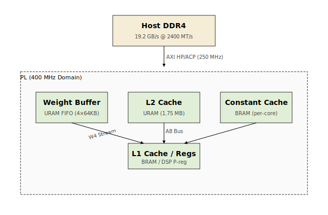

======================
메모리 계층
======================

pccx v002 메모리 서브시스템은 4단계 계층 구조다:
**host DDR4 → Weight Buffer / L2 캐시 → L1 / Constant Cache → 각 PE 내부 레지스터**.
각 레벨은 다음 레벨의 대역폭에 맞춰 크기가 정해져 있어 연산 코어의 데이터
기아를 막는다.

.. _v002-memory-hierarchy-fig:

   pccx v002 메모리 계층 및 인터커넥트 구조. 가중치와 활성값은 host DDR4에서
   URAM 기반 L2와 Weight Buffer를 거쳐 연산 전용 BRAM 캐시로 전달된다.

1. 계층
=============

.. list-table::
   :header-rows: 1
   :widths: 18 14 18 20 30

   * - 레벨
     - 저장체계
     - 용량 (KV260)
     - 최대 대역폭
     - 목적
   * - **L0 Register**
     - FF
     - Inside DSP48E2
     - 48 bit / clk / DSP
     - 누산기
   * - **L1 Cache**
     - BRAM
     - A few KB per core
     - 32 element / clk
     - GEMV 활성값 / 결과 임시저장
   * - **Constant Cache**
     - BRAM
     - A few KB per core
     - 16 bit × N / clk
     - ISA shape/size 포인터, 스케일 팩터
   * - **L2 Cache**
     - URAM
     - **1.75 MB** (114,688 × 128-bit; ~50 of 64 URAM)
     - 256 bit × 2 / clk (both slices)
     - 활성값, KV-cache, 중간 결과
   * - **Weight Buffer**
     - URAM (FIFO)
     - 4 × 64 KB (4 HP ports, 4096 deep each)
     - 128 bit/clk per HP port @ 250 MHz
     - INT4 가중치 스트림
   * - **Host DDR4**
     - External DRAM
     - 4 × 512 Mb × 16-bit
     - **19.2 GB/s**
     - 모델 가중치, 입력, 토큰 출력

2. 대역폭 정합
======================

2.1 가중치 경로
---------------

**목표**: HP 포트가 매 사이클마다 GEMM systolic array에 필요한 가중치 대역폭을
충분히 제공해야 한다.

- Systolic array: 32 × 32 = 1,024 DSP(400 MHz, 1개의 그리드,
  16행에서 두 개의 32 × 16 서브체인으로 분기).
- W4A8 듀얼 채널 패킹에서는 1 DSP = 2 MAC이므로, 2,048 MAC/clk이 된다.
- 가중치 요구량: 2,048 × 4 bit = **8,192 bit/clk @ 400 MHz**.
- 공급량: HP0 + HP1은 2 × 128 bit/clk @ 250 MHz(총 64 Gbit/s raw)를 제공하며,
  CDC FIFO 하류에서 ~160 bit/clk @ 400 MHz로 정규화된다.

격차는 가중치 재사용(Weight Stationary)으로 해소한다. GEMM systolic array는
가중치를 한 번 로드한 뒤 수백~수천 사이클 동안 재사용하고, Weight Buffer는
미리 패치(prefetch)만 수행한다. 정확한 재사용 패턴은
:doc:`gemm_core` 를 참고한다.

2.2 활성값 경로
-------------------

**목표**: L2 캐시가 GEMM, GEMV, SFU에서 동시성으로 발생하는 활성값
읽기 요청을 만족해야 한다.

- L2 캐시 포트: **듀얼 포트 URAM** — Port A는 ACP DMA, Port B는 NPU 연산이며,
  두 포트 모두 1클럭당 128-bit 폭을 가진다.
- GEMV 코어의 피크 활성값 요구량: 4개 코어 × 클럭당 32 INT8 요소 =
  총 128 INT8 요소/클럭이다. 하나의 128-bit URAM 읽기는 한 번에 16개 INT8
  요소를 공급하므로 GEMV 브로드캐스트 경로(동일 활성값이 네 코어에 공유)는
  한 포트 안에 수용된다.

2.3 Host ↔ Device 경로
----------------------

**목표**: 사전 채움(prefill) 시 모델 가중치를 로드하고 디코딩 시 KV-cache
업데이트와 토큰 출력을 처리한다.

- AXI ACP 포트를 통해 DMA를 수행한다. 상한은 host DDR4의 19.2 GB/s이다.
- v002.1 처리량 목표(:doc:`../../roadmap` 기준 약 20 tokens/s)에서는
  host ↔ device 트래픽의 대부분이 KV-cache 업데이트와 새 토큰 쓰기로
  구성되므로 예산 내에서 수용 가능하다.

3. 캐시 운용 정책
==========================

3.1 L2 캐시: 중앙 공유 스크래치패드
------------------------------------

L2 캐시는 소프트웨어 관리 스크래치패드로 동작한다. 전용 하드웨어 교체
정책은 없다. 주소는 명령어 스트림에서 직접 지정한다
(``MEMCPY dest_addr``, ``GEMM src_addr``).

1.75 MB인 L2는 8개 듀얼 포트 URAM bank로 분할되어 다중 코어 동시 접근을
지원한다.

.. pccx-memory-layout::
   :banks: 8
   :depth: 4
   :title: L2 Shared Buffer Bank Organization (URAM)

장점:

- 지연시간이 예측 가능하다(태그 매칭이나 miss 핸들링 없음).
- 컴파일러가 데이터를 정적 레이아웃으로 배치해 인터커넥트 경합을 회피할 수 있다.

3.2 Constant Cache: ISA 포인터 백엔딩 스토어
----------------------------------------------

ISA는 6비트 ``shape_ptr_addr``\  와 ``size_ptr_addr`` 필드를 통해
shape/size 메타데이터를 참조한다. 이 포인터는 Constant Cache의 64개
엔트리를 가리키며 MEMSET으로 사전 로드된다. 인코딩 규칙은
:doc:`../ISA/instructions` 를 참고한다.

3.3 Weight Buffer: 스트리밍 FIFO
----------------------------------

Weight Buffer는 HP 포트 프리패치와 코어 소비 사이 타이밍 오차를 흡수하는
원형 FIFO로 구현된다. bank-level interleaving을 통해 GEMM의 Weight Stationary
재사용과 GEMV의 Weight Streaming 패턴을 모두 처리한다.

4. 데이터 병목 완화
==============================

파이프라인 정지를 피하려면 전체 경로에서 더블 버퍼링을 사용한다.

- **GEMM 활성값**: L2와 PE 사이에서 ping-pong 버퍼.
- **GEMV 활성값**: L1 캐시를 bank별로 분할해 읽기와 쓰기를 병렬 진행.
- **가중치**: Weight Buffer 내부의 ping-pong FIFO.

이 설계는 이상적인 조건에서 각 연산 코어의 100% 이용률을 목표로 한다.
실측 이용률은 합성 결과가 확보되면 구현 섹션 문서에 보고한다.
