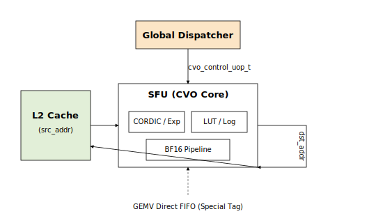

========================
지시어별 데이터 흐름
========================

이 페이지는 지시어가 디스패치된 뒤 하드웨어 내부에서 데이터가 실제로
흐르는 경로를 보여준다. 아래의 그림은 :doc:`../Architecture/top_level`의
블록 다이어그램을 지시어 관점에서 다시 정리한 것이다.

1. GEMM
========

.. figure:: ../../../../assets/images/Architecture/v002/DataFlow_GEMM_v002.png
   :align: center
   :width: 85%
   :alt: GEMM 지시어 데이터 흐름

그림 5: GEMM 지시어가 디스패치될 때의 데이터 흐름.
   ``dest_addr``와 ``src_addr`` 는 L2 캐시 주소 공간에 존재하며,
   shape/size 포인터가 Constant Cache를 가리킨다.

경로 요약
------------

1. Dispatcher가 Constant Cache에서 ``shape_ptr_addr`` / ``size_ptr_addr`` 를
   읽어 타일 파라미터를 얻는다.
2. Weight Buffer는 HP 포트에서 한 타일 분량의 가중치를 프리패치한다.
3. L2 캐시의 ``src_addr`` 값으로 활성값을 systolic array로 스트리밍한다.
4. 배열은 Weight Stationary → Accumulator → Post-Process 순으로 누산한다.
5. 결과는 ``dest_reg`` 위치의 L2 캐시에 다시 쓴다.

2. GEMV
=======

.. figure:: ../../../../assets/images/Architecture/v002/DataFlow_GEMV_v002.png
   :align: center
   :width: 85%
   :alt: GEMV 지시어 데이터 흐름

   **그림 6.** GEMV 지시어 데이터 흐름. ISA 레이아웃은 GEMM과 동일하지만
   가중치 소비는 **Weight Streaming** 방식이며, 4개의 GEMV 코어로 병렬
   분산한다.

경로 요약
------------

1. Dispatcher가 포인터를 해석해 코어별 shape 분배를 수행한다.
2. Weight Buffer → 4개 GEMV 코어로, 행(row partition) 단위로 스트리밍.
3. L2 캐시 → 코어별 L1 캐시로 활성값을 선적재.
4. 각 코어 내부 32-lane LUT 기반 MAC + 5단계 축소 트리로 스칼라 결과 생성.
5. 후처리(스케일, 바이어스) → L2 캐시 또는 SFU FIFO로 전달.

3. MEMCPY
=========

.. figure:: ../../../../assets/images/Architecture/v002/DataFlow_MEMCPY_v002.png.png
   :align: center
   :width: 70%
   :alt: MEMCPY 지시어 데이터 흐름

   **그림 7.** MEMCPY 지시어. ``from_device`` / ``to_device`` 조합으로
   host ↔ NPU 및 NPU ↔ NPU 전송을 지원한다.

지원 조합
----------------------

.. list-table::
   :header-rows: 1
   :widths: 20 20 60

   * - from_device
     - to_device
     - 경로
   * - 1 (Host)
     - 0 (NPU)
     - ACP → L2 캐시 쓰기. 가중치/입력 로드에 사용.
   * - 0 (NPU)
     - 1 (Host)
     - L2 캐시 → ACP. 출력 토큰 / KV 항목 반환.
   * - 0 (NPU)
     - 0 (NPU)
     - L2 내부 블록 이동(온디바이스 재배치).

``async = 1`` 일 때 실행은 다음 지시어로 즉시 넘어간다. 완료 펜스 추적은
Global Scheduler가 수행한다.

4. MEMSET
=========

.. figure:: ../../../../assets/images/Architecture/v002/DataFlow_MEMSET_v002.png
   :align: center
   :width: 70%
   :alt: MEMSET 지시어 데이터 흐름

그림 8: MEMSET은 Dispatcher에서 Constant Cache로 직접 기록한다.
   L2 캐시를 우회하는 유일한 지시어다.

특징
---------------

- 한 지시어는 한 번에 최대 3개의 16-bit 값(``a``, ``b``, ``c``)을 쓸 수 있다.
- 일반적으로 레이어 시작 시 (M, N, K) 튜플 초기화, 또는 가중치/활성값
  스케일 팩터 주입에 사용한다.
- ``dest_cache``는 대상 캐시 bank를 선택한다(``fmap_shape`` vs.
  ``weight_shape``).

5. CVO (SFU)
=============

특수 함수 유닛(SFU, 또는 CVO)은 BF16 스칼라 파이프라인에서 비선형 연산을
실행한다.

   **그림 9.** SFU(CVO) 지시어 데이터 흐름. L2 캐시 스트리밍과 GEMV 코어로부터
   직접 빠른 경로를 모두 지원한다.

빠른 경로: SFU가 직전 GEMV 출력을 즉시 소비하면 ``src_addr`` 값이
특수 태그로 설정되어 L2 왕복이 생략된다. Dispatcher의 의존성 추적 로직이
이를 자동으로 결정한다.

6. 의존성 및 완료 처리
===============================

지시어 간 의존성은 Global Scheduler가 다음 두 항목으로 처리한다.

- **주소 hazard**: dest / src L2 주소의 read-after-write 의존성.
- **자원 hazard**: GEMM / GEMV / SFU 자원 점유 상태.

비동기 지시어(``async = 1``)의 완료는 ``fsmout_npu_stat_collector`` 블록이 수집하며,
AXI-Lite STAT_OUT 레지스터를 통해 host로 보고한다.
